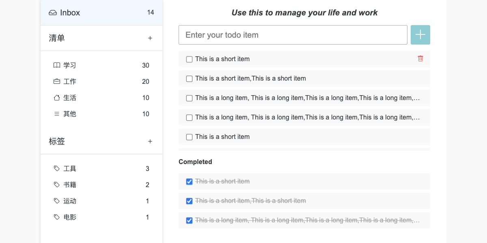
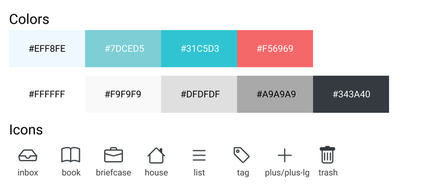
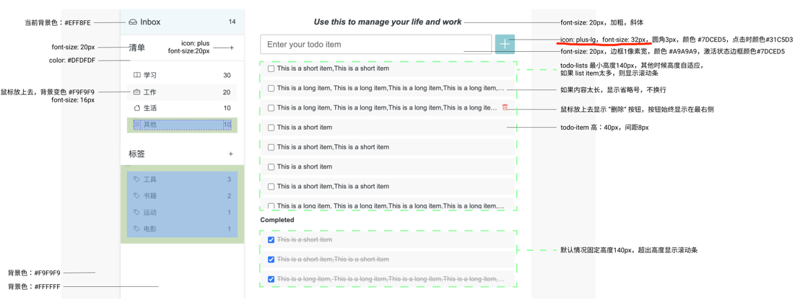
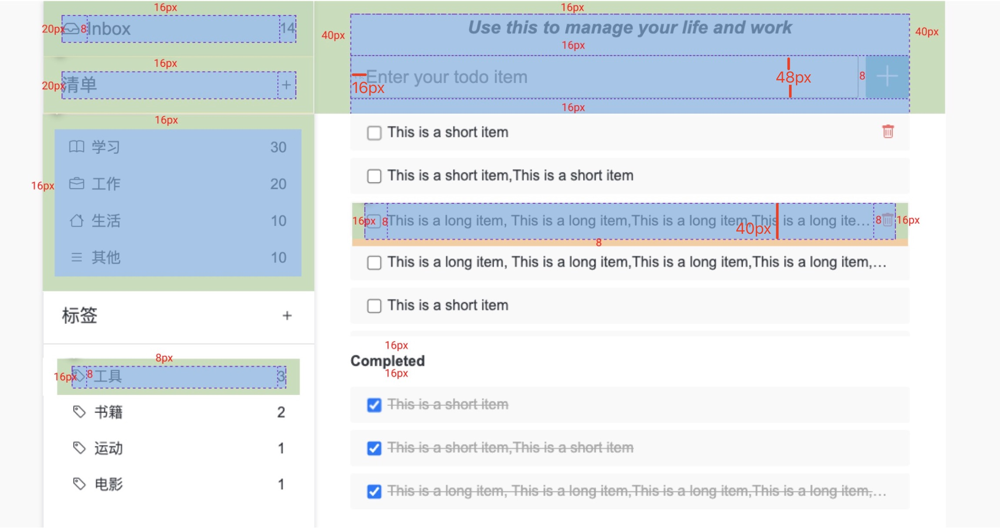
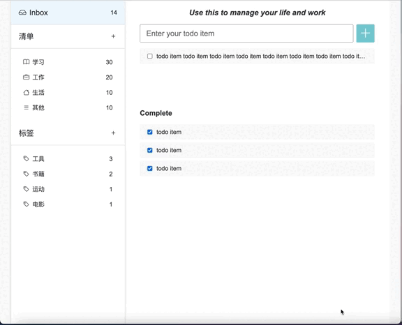
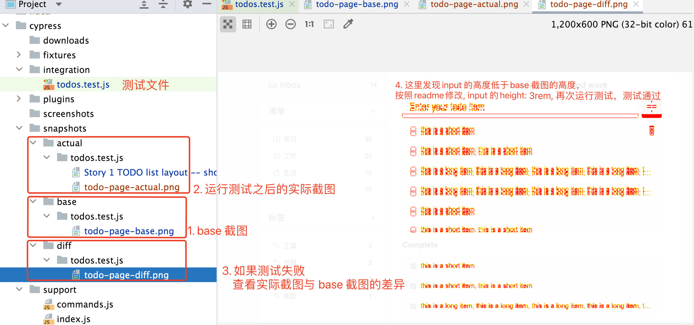

# TODO List Assignment

## 需求说明

实现静态页面，创建基本的页面结构和样式，暂不会涉及任何动态的效果，效果如下：



页面设计细节如下：



- 默认字体Arial, Helvetica, sans-serif，默认字体大小16px，颜色：#343A40 ，行高1.5
- 页面内容宽度1000px，高度为屏幕高度100%
- 左侧边栏宽度为30%，右边宽度70%
- 内边距值：8px，16px，20px，40px







## 技术提示

此问题需要修改的代码位于 _public_ 目录下。CSS 文件请放在 _public/styles_ 目录下，如果有JS，请放在 _public/scripts_ 目录下。

### HTML 和 CSS

请使用语义化标签创建基本的页面内容，CSS 完成页面布局和样式

### Icon

设计稿中使用的 Icon 为 [Bootstrap Icon](https://icons.getbootstrap.com/), 
Icon font 可以通过 Download 到本地或者 CDN 的方式使用，但是 CDN 的方式访问可能会不稳定，建议使用本地 icon font css: _public/styles/bootstrap-icons.css_  或者 SVG 的方式，
详细请参考 https://icons.getbootstrap.com/

### Sass

_public/styles_ 目录下提供了 _reboot.scss 和 _variables.scss 文件，请根据需要确定是否采用。

## 环境准备

### 下载依赖

```bash
$ npm install
```

### 运行网站

请执行如下代码运行网站并打开页面：

```bash
$ npm start
```

之后在浏览器中访问：http://localhost:3000

### 运行测试

请使用如下代码在终端运行测试，会对比实际页面和期望页面的差异:

```
$ npm start
$ npm run test
```
本次 assignment 用了[cypress](https://www.cypress.io/) 以及 [cypress-visual-regression](https://github.com/mjhea0/cypress-visual-regression) 进行测试

- 测试文件位置： cypress/integration/todos.test.js
- 测试会打开 1200 * 600 的网页窗口测试页面完成度  
- 测试会对比实际页面完成度与 base 图像之间的差异



## 提交要求
- 请在 coach 建议的完成时间内提交，提交时请确保录屏也已完成；
- 通过金数据表单提交 assignment，提交成功后会收到系统通知；
- 批改会使用提交时间点所对应的版本，请务必在确认无误后再进行提交；
- 获取录屏的具体方式请写在 RECORDING.md 中，确保 buddy/coach 能够访问；
- 本次 assignment 录屏时长保持在 45 分钟以内；
- 大家在本次录屏中可以适当减少解说的时间，只需说明当前要开始或者正在进行的步骤即可，不用像 coach 在 demo 中那样“啰嗦”；
- 尽量在录屏中完成所有内容，如果无法在录屏中完成，可以说明剩余部分的实现思路并 push 所有 commits。

## 评分标准
代码的评价包括但不限于如下几个层方面
- 是否通过了测试 (满足 mockup)
  - 字体，大小，样式，颜色正确
  - 布局、元素间距正确
  - 鼠标 hover 左侧菜单栏 item 背景颜色正确
  - 鼠标 hover 右侧 todo list item，显示红色 "删除" 按钮
  - input 在输入的时候框边框颜色正确
  - "添加" 按钮点击时颜色正确
  - todo-lists 高度自适应，最小高度 140px，超长出现滚动条
- 是否满足语义化 HTML
- 是否使用了正确的编码实践
  - 代码的格式是否正确
  - 代码的命名是否有意义
  - 代码是否遵循了小步提交原则
  - 代码的提交信息是否明确有意义
- **快捷键（本次 assignment 需要练习以下几个快捷键）**
  - 切换 IntelliJ 和浏览器 (Mac: Cmd + Tab / Windows: Alt + Tab)
  - 打开浏览器的调试窗口 (F12 或者 Cmd + Opt + I for Mac)
  - 清除浏览器缓存并刷新页面 (Mac: Cmd + Shift + R / Windows: Ctrl + Shift + R)
  - 在 IntelliJ 中通过最近打开的文件切换 html 和 css 文件 (Mac: Cmd + E / Windows: Ctrl + E)

根据以上标准，评级会分为四个级别：
- **Level-0**：无法达到 Level-1 时，或录屏中代码绝大部分是 copy 过来，没有体现手动编写的过程的
- **Level-1**：能够正常访问页面，布局大致符合需求，页面比较粗糙（比如侧边栏和主要内容的左右布局，列表样式样式与设计稿差异不大），有小步提交，并且至少使用两组快捷键（eg. 切换 Idea 和浏览器，打开浏览器的调试窗口）
- **Level-2**：通过测试（测试允许一点点误差），基本符合需求所规定的布局和样式，允许一两个小的错误和偏差，并且满足 Level-3 中的一到两个条件
- **Level-3**：完美符合需求，HTML 符合语义化标准，小步提交且提交信息语义明确，代码格式化，熟练使用快捷键

## 我应该学到什么？
Assignment 的目的是学以致用，在运用当前 step 所学的知识和技能合理完成题目要求的前提下，你 应该/可能 会使用（但不限于）以下内容：

1. 理解 html 结构；
2. 在 html 中应用 css;
3. 使用合理的（语义化的）html 标签构建页面元素
4. 使用 css 完成布局和样式
5. 了解 icon font 和 svg
6. 了解 HTTP server
7. 了解 Sass
8. 快捷键的使用

**如果你在完成 assignment 后，发现以上的大部分内容都并未涉及（使用）到，请及时联系 coach 进行沟通。**
